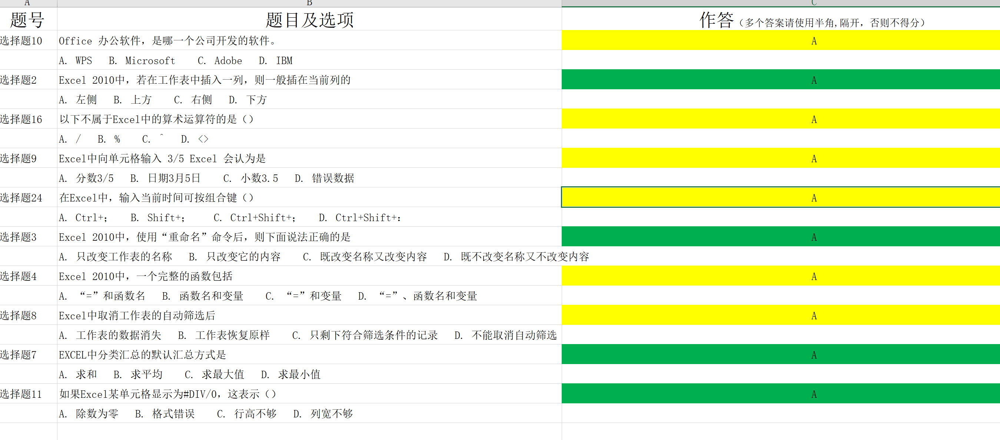

软件学报ISSN 1000-9825, CODEN RUXUEW E-mail: jos\@iscas.ac.cn

*Journal of Software*, [doi: 10.13328/j.cnki.jos.000000] http://www.jos.org.cn

©中国科学院软件研究所版权所有. Tel: +86-10-62562563

基于Excel VBA和Go语言的自动化考试系统[^1]

[^1]: ∗ 青海大学计算机技术与应用系数据分析与处理技术——Excel应用方向课程设计

李怡龙1

1(青海大学 计算机技术与应用系,青海 西宁 810000)

通讯作者: 李怡龙, E-mail: leeli\@live.cn

摘 要:
针对期末考试任务繁重、考试系统依赖环境多安装复杂等情况，开发了前端基于EXCEL使用VBA语言、后端基于Go语言的自动化考试系统，实现了无纸化上机考试、结果批改和作弊检测一体，并给出了一种通用Microsoft
Excel自动化考试系统的设计方法及通用的考试服务器及相关API接口，本文主要介绍了系统构成与功能实现.

关键词: Excel;考试系统;Go语言;Excel VBA

中图法分类号: NB945

中文引用格式: 李怡龙.基于Excel VBA和Go语言的自动化考试系统.软件学报.
http://www.jos.org.cn/xxxx-xxxx/ xxxx.htm

英文引用格式: Li Yilong. Automated Examination System Based on Excel VBA and Go
Language. Ruan Jian Xue Bao/Journal of Software, 2019 (in Chinese).
http://www.jos.org.cn/xxxx-xxxx/xxxx.htm

Automated Examination System Based on Excel VBA and Go Language

Li Yilong1

1(Department of Computer Technology and Applications, QingHai University,
QingHai 810000, China)

**Abstract**: Aiming at the heavy task of final examination and the complex
installation of examination system depending on environment, an automated
examination system based on EXCEL using VBA language at the front end and Go
language at the back end is developed, which realizes the integration of
paperless computer examination, result correction and cheating detection. A
general design method of Microsoft Excel automated examination system and a
general test server are given. Related API interface, this paper mainly
introduces the system structure and function realization.

**Key words**: Excel;Examination System;Golang;Excel VBA

无纸化的上次考试是目前很多学校计算机方面考试的首先选择，但是现在市面上有很多各式各样的的考试系统，但是他们都以一个特点就是需要安装和配置相关的环境，相对来说比较麻烦，所以笔者就使用最常见的Excel配合上VBA编程和后端的Go语言编程实现了一个具有自动生成题目、批改、收集为一体的自动化考试系统，学生端无需安装多余环境、服务器端也只有一个可执行文件。充分简化考试系统的搭建和使用难度.

Go（又称Golang）是Google开发的一种静态强类型、编译型、并发型，并具有垃圾回收功能的编程语言.

Visual Basic for Applications（VBA）是Visual
Basic的一种宏语言，是微软开发出来在其桌面应用程序中执行通用的自动化(OLE)任务的编程语言。主要能用来扩展Windows的应用程序功能，特别是Microsoft
Office软件。也可说是一种应用程式视觉化的Basic
脚本。该语言于1993年由微软公司开发的的应用程序共享一种通用的自动化语言--------Visual
Basic for
Application(VBA)，实际上VBA是寄生于VB应用程序的版本。微软在1994年发行的Excel5.0版本中，即具备了VBA的宏功能.

系统构成与功能
==============

系统Excel端共有7张数据表构成，囊括了基础设置、教师服务等，服务器端包含2个Go源代码文件，分别为服务器程序和反作弊程序.

开始工作表
----------

图1 开始工作表

该工作表主要用于用户输入姓名、学号、班级、考试服务器等信息。提供三个功能按钮，分别用于测试连接服务器、刷新考试信息和验证学生信息是否正确。

当考试开始后即可点击开始考试按钮获取试题并考试；提交试卷按钮用于答题完成后提交成绩及答案。试卷成功提交后，开始工作表将会被隐藏。

教师端工作表
------------

图2 教师端工作表

教师端工作表主要用于教师设置考试信息，包括考试名称、考试时间、题目数量及分值；同时在考试结束后可以获取成绩单、下载简答题和操作题压缩包；在考试过程中可以点击按钮获取异常行为表。

图3 成绩单

图4 异常行为表

答题工作表
----------

答题工作表共有5张，分别用于展示选择题、填空题、判断题、简答题和操作题的题干及填写答案，相关考试资源也会自动下载到指定目录。考试结束后，答案正确与否也会以颜色区分。

图5 选择题

图6 填空题

图7 判断题

图8 简答题

图9 操作题

服务器题库设置
--------------

服务器端题库采用txt文本格式，位于data文件夹下，题目定义结构为题干一行，答案一行。

图10 文件夹目录结构

图11 部分题库格式

文件上传
--------

因为操作题和简答题拥有一定主观性，所以采用手动批改的形式，系统为其提供了一个上传接口。

图12 上传页面

服务器端目录结构
----------------

服务器端共有bin、data和upload三个文件夹，bin文件夹用于存储反作弊程序、data文件夹用于存储题库和学生信息、upload文件夹用于存储用户上传的操作题数据。

系统实现
========

首先建立考试系统.xlsm 基于Go语言建立HTTP服务器.

连接服务器
----------

采用Get和POST请求的形式与服务器进行交互，上传信息和下载数据。

图13 通过Get请求获取操作题

x64环境下创建x86对象
--------------------

因为Excel VBA
CerateObject函数无法在x64环境下创建x86对象，而有部分功能必须要使用到x86下的组件，所以使用手动的方法构建了一个新的函数CreateObjectx86，具体实现如下图

图14 CreateObjectx86实现

解析JSON数据
------------

因为Excel
VBA和服务器需要有大量的数据交互，这里笔者选用了轻量的JSON的形式存储，在VBA中使用ScriptControl库使用JavaScript解析JSON。

图15 使用ScriptControl解析JSON

评分方法
--------

该系统的评分方法为获取用户输入答案和服务器上的正确答案，对比后按照正确数量乘以单题分数最终计算出单项成绩。最后汇总单项成绩获得总成绩。

下载考试资源
------------

操作题和反作弊系统都需要从服务器下载相关资源，笔者使用XMLHTTP库进行文件下载。

图16 文件下载

反作弊程序
----------

在考试系统中，反作弊也是非常重要的。本系统的反作弊主要有HTTP流量劫持，U盘检测和进程检测。

HTTP流量劫持主要使用proxy技术，设定本地代理后截断一切流量。

U盘检测是从注册表读取USB设备信息，并判断是否插入U盘。

进程检测主要调用Windows API获取进程列表并判断。

反破解程序
----------

因为VBA的特殊性，代码可能暴露在用户手中。所以就需要对代码进行保护。主要采用破坏型锁定方法，修改xlsm文件下的vbaProject.bin中的id位元组，破坏Excel查看代码部分的连接以达到保护的目的。

图17 工程不可查看

结束语
======

本系统可以大大降低考试系统的部署难度和使用成本，而且相对于一般的考试系统拥有更完善的反作弊机制和自动批改机制。同时提供了一个通用的Excel
VBA考试系统设计方法和通用的考试系统后端系统和API接口。

References:

1.  Wang Q, Wu SJ, Li MS. Software defect prediction. Ruan Jian Xue Bao/Journal
    of Software, 2008,19(7):1565−1580 (in Chinese with English abstract).
    http://www.jos.org.cn/1000-9825/19/1565.htm

附中文参考文献:

[1] 邹运兰. 基于Microsoft Excel的测试系统的设计与实现[J]. 计算机与数字工程,
2005, 33(12):151-153.

[2] 陈钦荣, 李欢悦. 基于EXCEL上机考试系统的设计与实现[J]. 计算机时代,
2014(9):79-81.

[3] 百度百科，Go语言词条

[4] 百度百科，VBA词条

[5]
如何尽可能的保护VBA代码？，博客园，原始出处<https://www.cnblogs.com/saveutime/p/vbaprotect.html>

[6]
vba-网络抓取（get，post），CSDN博客，原始出处<https://blog.csdn.net/qq_41777527/article/details/81141854>

[7]
VBA中使用JavaScript脚本语言解析JSON数据，博客园，原始出处<https://www.cnblogs.com/zzstone/p/5569723.html>

[8]
关于网抓，文件下载，文件操作，Excel技巧网，原始出处<http://www.exceltip.net/thread-95177-1-1.html>
